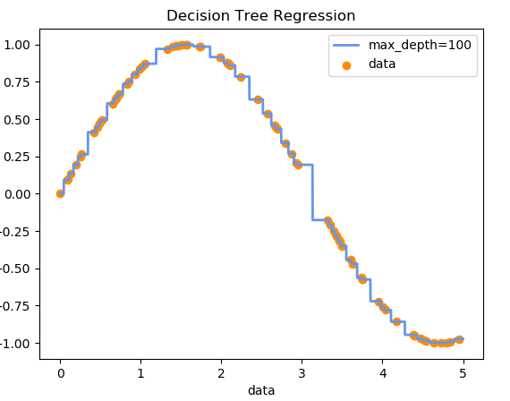
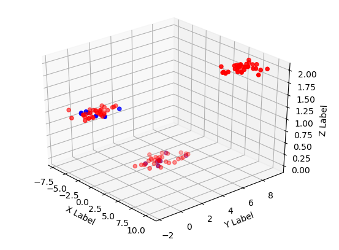
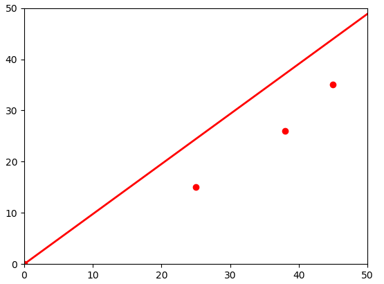

# LinearRegression
Un modèle de régression linéaire est un modèle de régression qui cherche à établir une relation linéaire entre une variable et une ou plusieurs variables de type: ax
## Prérequis
Pour faire fonctionner ce programme il vous faut:
numpy
sklearn
matplotlib

Si ils ne sont pas installés:
```
pip install numpy
pip install sklearn
pip install matplotlib
```
## DecisionTree.py



## LogisticRegression.py



## LinearRegression.py
Lancer le script:
```
python LinearRegression.py
```

Le programme va vous demander le Min et Max en x et y pour permettre de placer les axes.
Exemple:
```
Min x:0
Max x:50
Min y:0
Max y:50
```

Puis les 'data' (données).
exemple:
```
To stop : 'n'
x 0 :0
x 1 :25
x 2 :38
x 3 :45
x 4 :n
x:  [0.0, 25.0, 38.0, 45.0]

To stop : 'n'
y 0 :0
y 1 :15
y 2 :26
y 3 :35
y 4 :n
y:  [0.0, 15.0, 26.0, 35.0]
```

Le programme va vous montrer le resultat en graphique est en affichant le coefficient a.


